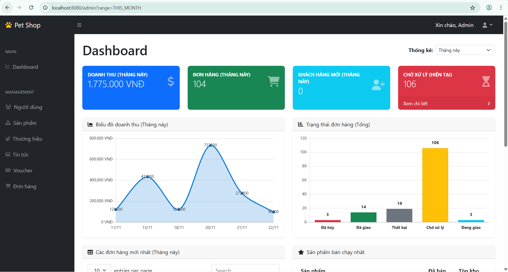
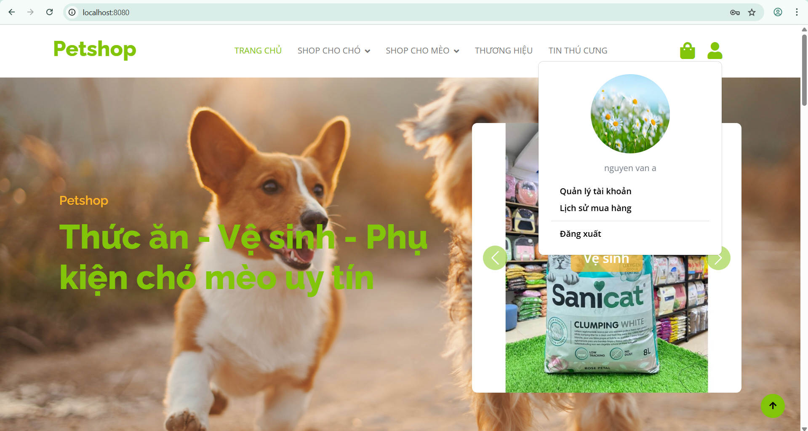
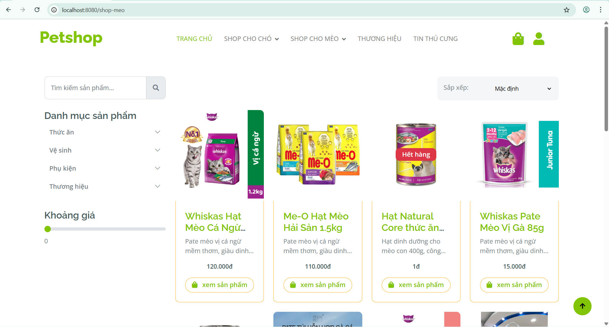
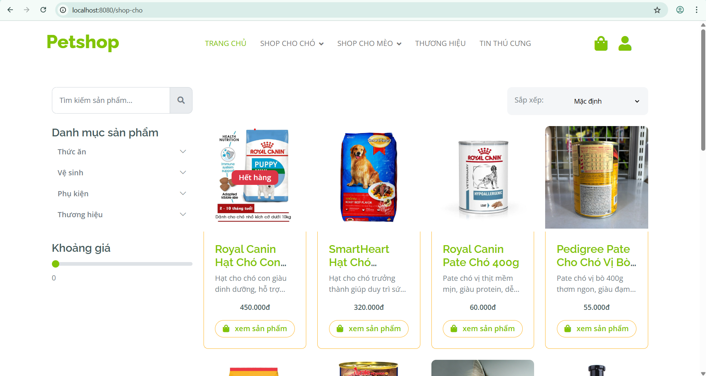
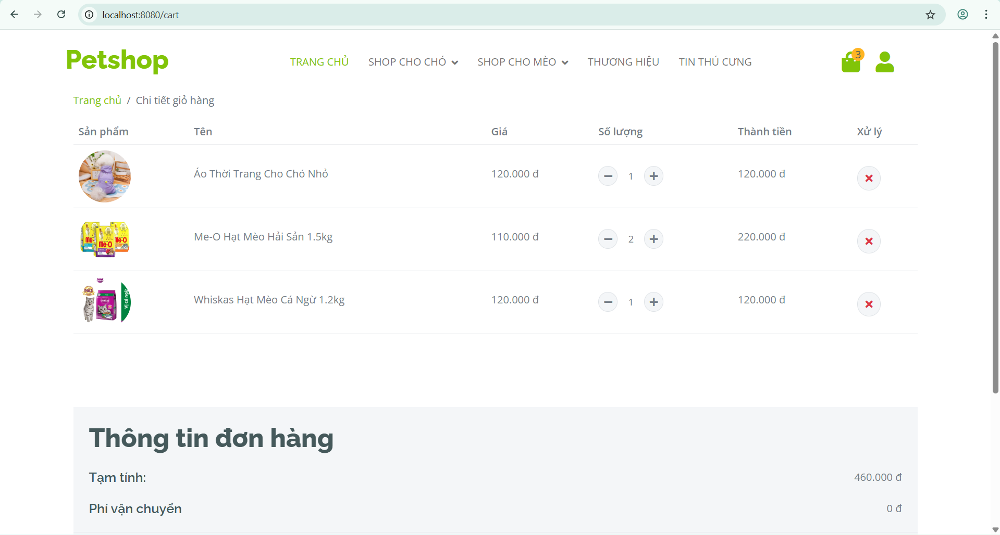
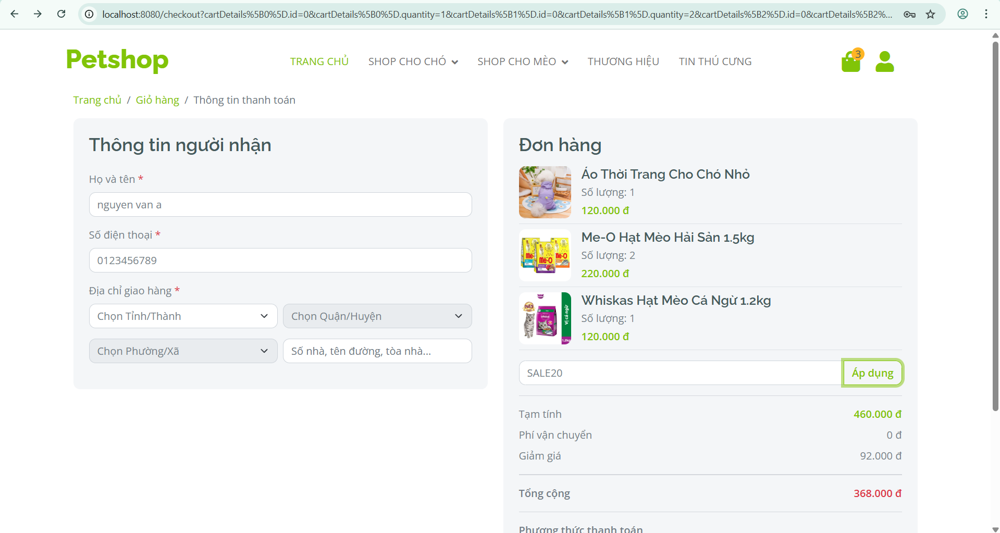
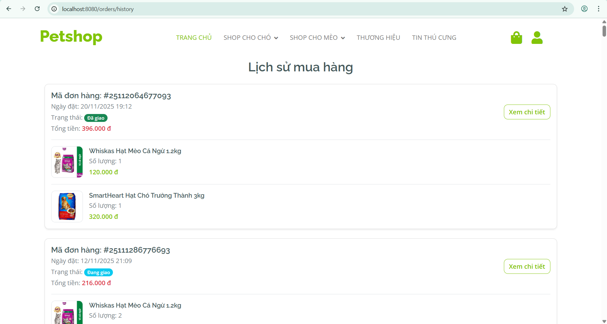
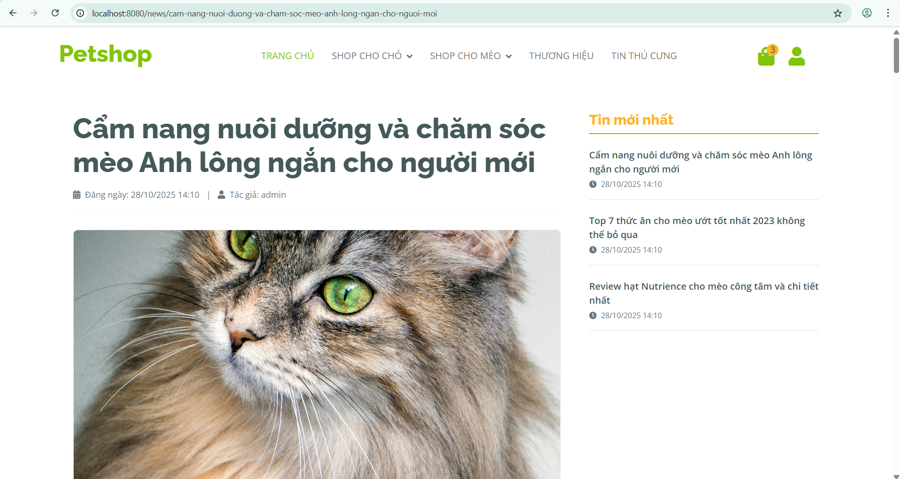

# Pet Shop E-Commerce Platform

A complete e-commerce system for a pet shop built with Spring Boot and JSP.  
Includes product catalog, shopping cart, order processing, user authentication, admin dashboard, voucher system, and VNPAY payment integration.

---

## Technologies
- Spring Boot  
- Spring MVC  
- JSP / JSTL  
- Spring Data JPA  
- MySQL  
- VNPAY Payment Gateway  
- Servlet API  
- Bootstrap / jQuery  

---

## Main Features

### Storefront (Customer)
- Browse products by categories, brands, filters
- Product detail page
- Add to cart, update quantity, remove items (no login required)
- Guest checkout supported
- User registration and login
- Profile management
- VNPAY payment flow (supports guest & logged-in users)
- Keyword suggestions & product search
- Filter by price, brand, category
- Voucher system during checkout
- Order tracking (with or without login)
- News section

### Admin Dashboard
- User management
- Product management
- Voucher management
- Brand management
- Category management
- News management
- Order management (view, update status)
- Dashboard statistics

---

## Installation

### 1. Clone this repository
```
https://github.com/vvnchuong/petshop.git
```
- Import the project inside Eclipse/Intellij IDE.
## 2. Create Database
- import the database [petshop](./database/petshop.sql).
## 3. Configure Application
```
spring.application.name=pet
spring.jpa.hibernate.ddl-auto=update
spring.datasource.url=jdbc:mysql://${MYSQL_HOST:localhost}:3306/petshop
spring.datasource.username=YOUR_USERNAME
spring.datasource.password=YOUR_PASSWORD
spring.datasource.driver-class-name=com.mysql.cj.jdbc.Driver

spring.mail.host=smtp.gmail.com
spring.mail.port=587
spring.mail.username=YOUR_EMAIL
spring.mail.password=YOUR_APP_PASSWORD
spring.mail.properties.mail.smtp.auth=true
spring.mail.properties.mail.smtp.starttls.enable=true
spring.mail.properties.mail.smtp.starttls.required=true

app.email-comment=YOUR_EMAIL
```

## 4. Start the application
- Access: http://localhost:8080

# Default Account
### Admin
- username: admin  
- password: 123456

### Customer
- username: meomeo
- password: 123123

# Access
- Homepage: http://localhost:8080

- Admin Panel: http://localhost:8080/admin

# Preview
## Admin


## Client








